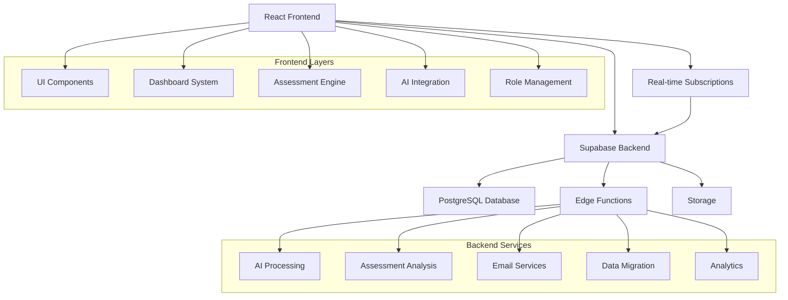
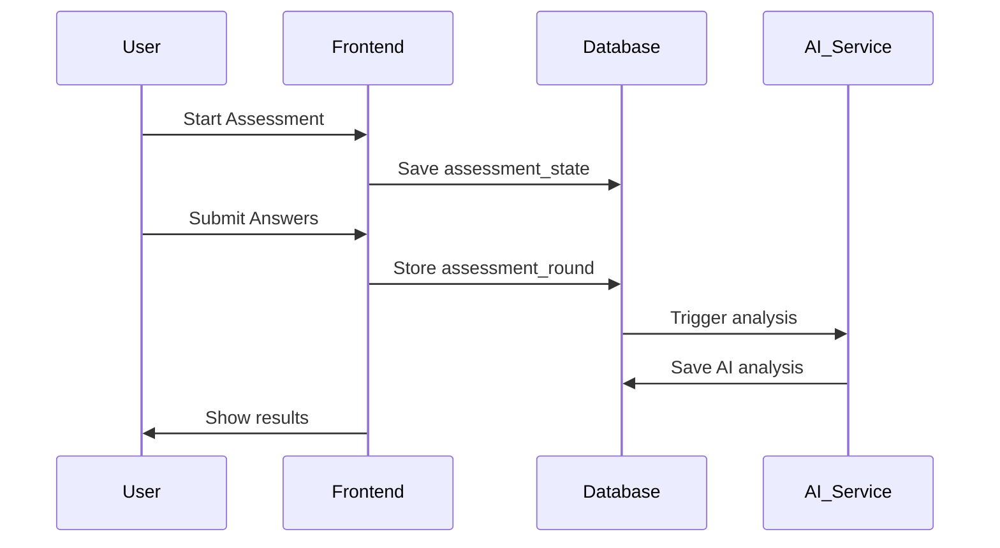
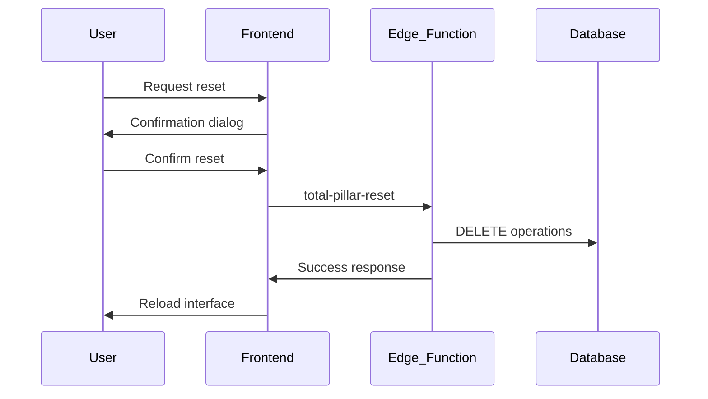

# 🏗️ SHMMS SYSTEM ARCHITECTURE OVERVIEW

**Version:** 2.0  
**Updated:** 2025-08-14  
**Scope:** Complete system architecture for development team replication

---

## 🎯 SYSTEM OVERVIEW

SHMMS (Six Human Management Methodology System) is a comprehensive personal development platform built on the "Six Pillars" methodology for holistic human development.

### Core Methodology: Six Pillars
1. **Självomvårdnad** (Self Care) - Personal health and wellbeing
2. **Kompetenser** (Skills) - Professional skill development  
3. **Talang** (Talent) - Natural abilities and strengths
4. **Varumärke** (Brand) - Personal branding and reputation
5. **Ekonomi** (Economy) - Financial management and growth
6. **Öppna Spåret** (Open Track) - Custom development areas

---

## 🏛️ HIGH-LEVEL ARCHITECTURE



---

## 💻 FRONTEND ARCHITECTURE

### Technology Stack
- **Framework:** React 18.3.1 with TypeScript
- **Build Tool:** Vite
- **Styling:** Tailwind CSS + shadcn/ui components
- **State Management:** React hooks + Context providers
- **Routing:** React Router DOM
- **Authentication:** Supabase Auth

### Component Architecture
```
src/
├── components/           # Reusable UI components
│   ├── ui/              # Base shadcn components
│   ├── Dashboard/       # Dashboard system
│   ├── Assessment/      # Assessment engine
│   ├── AI/             # AI integration components
│   └── Shared/         # Cross-feature components
├── pages/              # Route components
├── hooks/              # Custom React hooks
├── providers/          # Context providers
├── utils/              # Utility functions
└── config/             # Configuration files
```

### Design System
- **CSS Architecture:** Semantic tokens in `index.css` + `tailwind.config.ts`
- **Color System:** HSL-based with role-based theming
- **Component Library:** shadcn/ui with custom variants
- **Responsive Design:** Mobile-first with breakpoint system
- **Accessibility:** WCAG 2.1 AA compliance

---

## 🗄️ DATABASE ARCHITECTURE

### Supabase PostgreSQL Schema

#### Core User Tables
```sql
-- User profiles and authentication
profiles               (id, email, first_name, last_name, ...)
user_roles            (user_id, role, assigned_at, ...)
coach_client_assignments (coach_id, client_id, is_active, ...)

-- Assessment system
assessment_rounds     (user_id, pillar_type, answers, scores, ...)
assessment_states     (user_id, form_data, current_step, ...)
assessment_templates  (pillar_key, questions, scoring_config, ...)

-- AI and coaching
ai_memories          (user_id, content, embedding, metadata, ...)
ai_coaching_sessions (user_id, session_type, recommendations, ...)
coaching_plans       (user_id, focus_areas, milestones, ...)

-- Activity management
calendar_actionables (user_id, title, pillar_key, scheduled_date, ...)
calendar_events      (user_id, title, event_date, category, ...)

-- Analytics and tracking
analytics_events     (user_id, event, properties, timestamp, ...)
analytics_metrics    (user_id, metric_type, metric_value, ...)
```

#### Row Level Security (RLS)
```sql
-- Users can only access their own data
CREATE POLICY "users_own_data" ON profiles 
    FOR ALL USING (auth.uid() = id);

-- Coaches can access assigned clients
CREATE POLICY "coach_client_access" ON assessment_rounds
    FOR SELECT USING (
        auth.uid() = user_id OR 
        is_coach_of_client(auth.uid(), user_id)
    );

-- Admins have full access
CREATE POLICY "admin_full_access" ON profiles
    FOR ALL USING (is_admin(auth.uid()));
```

---

## ⚡ BACKEND SERVICES (Edge Functions)

### Core Functions
```typescript
// Assessment processing
analyze-assessment     // AI analysis of user responses
analyze-pillar-assessment // Specific pillar evaluation
consolidate-assessment-system // Data consolidation

// AI services  
stefan-ai-chat        // AI conversation interface
generate-ai-planning  // Personalized development plans
enhanced-ai-planning  // Advanced planning with context

// User management
admin-create-user     // Admin user creation
admin-password-reset  // Password management
claim-invitation      // Invitation processing

// Communications
send-welcome-email    // User onboarding emails
send-invitation       // System invitations
email-orchestrator    // Email workflow management

// Data processing
analytics-processor   // Event data processing
error-logger         // System error tracking
gdpr-processor       // Data privacy compliance
```

### Function Architecture Pattern
```typescript
// Standard edge function structure
import { serve } from "https://deno.land/std@0.168.0/http/server.ts"
import { createClient } from 'https://esm.sh/@supabase/supabase-js@2'

const corsHeaders = {
  'Access-Control-Allow-Origin': '*',
  'Access-Control-Allow-Headers': 'authorization, x-client-info, apikey, content-type',
}

serve(async (req) => {
  if (req.method === 'OPTIONS') {
    return new Response(null, { headers: corsHeaders });
  }

  try {
    const { param } = await req.json();
    const supabase = createClient(
      Deno.env.get('SUPABASE_URL')!,
      Deno.env.get('SUPABASE_SERVICE_ROLE_KEY')!
    );

    // Function logic here
    const result = await processData(param);

    return new Response(JSON.stringify(result), {
      headers: { ...corsHeaders, 'Content-Type': 'application/json' },
      status: 200,
    });
  } catch (error) {
    return new Response(JSON.stringify({ error: error.message }), {
      headers: { ...corsHeaders, 'Content-Type': 'application/json' },
      status: 400,
    });
  }
});
```

---

## 🔐 AUTHENTICATION & AUTHORIZATION

### Role-Based Access Control
```typescript
// User roles hierarchy
type UserRole = 'client' | 'coach' | 'admin' | 'superadmin';

// Permission system
interface DashboardConfig {
  role: UserRole;
  permissions: string[];
  features: string[];
  widgets: DashboardWidget[];
  navigation: DashboardNavItem[];
}

// Access control functions
function hasPermission(role: UserRole, permission: string): boolean;
function is_coach_of_client(coach_id: uuid, client_id: uuid): boolean;
function is_admin(user_id: uuid): boolean;
function superadmin_god_mode(user_id: uuid): boolean;
```

### Security Features
- **Multi-factor Authentication:** PKCE flow with Supabase
- **Session Management:** Persistent sessions with auto-refresh
- **API Security:** Service role keys for sensitive operations
- **Data Encryption:** At-rest and in-transit encryption
- **Audit Logging:** All admin actions logged

---

## 🧠 AI INTEGRATION

### Stefan AI System
```typescript
// AI memory system
interface AIMemory {
  user_id: uuid;
  content: string;
  embedding: vector;
  metadata: jsonb;
  tags: string[];
  score: number;
}

// AI processing pipeline
1. User input → Text analysis
2. Context retrieval → Memory search  
3. AI generation → Personalized response
4. Memory storage → Learning loop
```

### AI Functions
- **stefan-ai-chat:** Conversational AI interface
- **stefan-memory-search:** Context-aware memory retrieval
- **stefan-text-analysis:** Natural language processing
- **generate-recommendations:** Personalized suggestions

---

## 📊 ANALYTICS & MONITORING

### Event Tracking System
```typescript
// Analytics event structure
interface AnalyticsEvent {
  user_id?: uuid;
  event: string;
  properties: jsonb;
  session_id: string;
  timestamp: timestamp;
  page_url?: string;
  user_agent?: string;
}

// Key metrics tracked
- User engagement (page views, time spent)
- Assessment completion rates
- Pillar progression metrics
- AI interaction patterns
- System performance metrics
```

### Monitoring Tools
- **Error Tracking:** Centralized error logging
- **Performance Monitoring:** Response time tracking
- **Usage Analytics:** User behavior analysis
- **System Health:** Database and API monitoring

---

## 🔄 DATA FLOW PATTERNS

### Assessment Flow


### Pillar Reset Flow


---

## 🔧 DEVELOPMENT SETUP

### Required Environment
```bash
# Node.js and package manager
node >= 18.0.0
npm >= 9.0.0

# Supabase CLI
supabase >= 1.0.0

# Environment variables
VITE_SUPABASE_URL=your_project_url
VITE_SUPABASE_ANON_KEY=your_anon_key
```

### Project Setup Commands
```bash
# Clone and install
git clone [repository]
cd shmms
npm install

# Start development
npm run dev

# Database migrations
supabase db reset
supabase migration up

# Deploy edge functions
supabase functions deploy
```

---

## 📈 PERFORMANCE CONSIDERATIONS

### Frontend Optimization
- **Code Splitting:** Lazy loading for routes and components
- **Bundle Optimization:** Tree shaking and minification
- **Caching Strategy:** Service worker for static assets
- **Image Optimization:** WebP format with fallbacks

### Backend Optimization
- **Database Indexing:** Optimized queries for common patterns
- **Connection Pooling:** Managed by Supabase
- **Edge Function Performance:** Minimal cold start times
- **CDN Distribution:** Global content delivery

---

## 🚀 DEPLOYMENT ARCHITECTURE

### Environment Strategy
```
Development → Staging → Production

- Development: Local development with Supabase
- Staging: Preview deployments for testing
- Production: Live system with monitoring
```

### CI/CD Pipeline
```yaml
# Automated deployment pipeline
Build → Test → Security Scan → Deploy → Monitor

- Automated testing on pull requests
- Security scanning for vulnerabilities  
- Automated deployment to staging
- Manual promotion to production
```

---

**CONCLUSION:** This architecture provides a solid foundation for a scalable, maintainable personal development platform with enterprise-grade security and performance characteristics.

**For Development Teams:** This documentation contains all necessary information to replicate the system architecture and implement similar functionality.