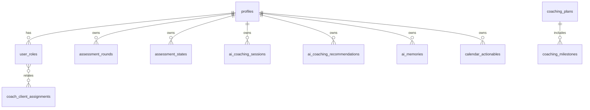
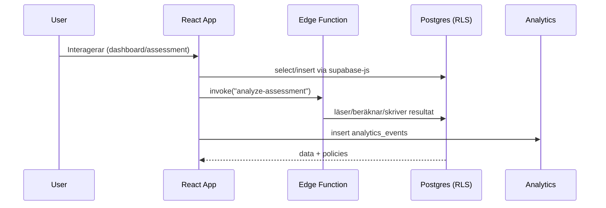

# SHMMS Systemkarta (Living Document)

Senast uppdaterad: {{DATE}}

Syfte: Ge en helhetsbild av SHMMS – arkitektur, roller, dataflöden, huvuddataset, event/analys, AI-lager och säkerhet. Detta är en levande källa som uppdateras fortlöpande.

---

## Översikt
- Enhetlig identitet: user_id är Single Source of Truth; roller och funktioner appliceras som labels/metadata.
- Frontend: React + TypeScript + Tailwind, semantiskt UI, tillgänglighet och mobilt först.
- Backend: Supabase (Auth, Postgres med RLS, Storage) + Edge Functions (Deno) för affärslogik.
- Universellt datalager + eventsystem: centraliserade hooks och loggning/analys i analytics_events m.fl.
- AI/Coachning: ai_* och coaching_* tabeller, Edge Functions för analys/generering och uppföljning.

---

## Hög-nivå arkitektur
```mermaid
flowchart LR
  A[React App (Vite, TS, Tailwind)] -->|Supabase-js| B[Supabase Auth]
  A -->|Queries/Mutations| C[(PostgreSQL + RLS)]
  A -->|Invoke| D[Edge Functions (Deno)]
  D --> C
  D --> E[(Analytics/AI Logs)]
  C <--> F[Storage]
  A --> G[Analytics Events]
  G --> E
```

- All åtkomst sker med stark RLS och roll-/policykontroller.
- Edge Functions orkestrerar tunga/sekretesskänsliga flöden och skriver revisions-/analysloggar.

---

## Roller och behörigheter
- Användare: Egen data, egna sessioner, egna analyser.
- Coach: Rättigheter via relationer (coach_client_assignments), insikter och klientflöden.
- Admin: Systemövervakning, administration av data/roller, GDPR-stöd.
- Superadmin: God mode-policies, fullständig systemförvaltning och backup-tabeller.

RLS-princip: Policies begränsar rad-/kolumnåtkomst per roll och relation; audit via admin_audit_log, händelser via analytics_events/ai_usage_logs.

---

## Datamodell (förenklad ER)


Nyckeltabeller:
- profiles, user_roles, coach_client_assignments
- assessment_* (rounds, states, questions, definitions)
- ai_* (memories, coaching_sessions, recommendations, usage_logs, service_logs)
- coaching_* (plans, milestones, progress_entries)
- analytics_* (events, metrics, aggregations)
- calendar_actionables, calendar_events

---

## Kärnflöden (exempel)


---

## Universellt datalager och eventsystem
- Centrala hooks (exempel): useUnifiedDataLayer, useCentralizedData, useGlobalUserEvents, useAnalytics/useRealAnalytics.
- Händelser: analytics_events, ai_usage_logs, admin_audit_log; Edge Functions kan också logga till ai_service_logs.
- Diagnostik/Integritet: utils/systemDiagnosis.ts och utils/systemIntegrityChecker.ts för hälsa, konsistens och automatiska fixes.

---

## AI- och coachningslager
- AI-minnen: ai_memories med embedding/metadata.
- Sessioner/rekommendationer: ai_coaching_sessions, ai_coaching_recommendations; pipelines via Edge Functions (t.ex. generate-ai-planning, enhanced-ai-planning, proactive-coaching-scheduler).
- Framsteg: coaching_plans, coaching_milestones, coaching_progress_entries; kopplade till kalenderelement.

---

## Assessments
- Mallar/definitioner: assessment_form_definitions, assessment_questions.
- Tilldelningar och genomföranden: assessment_form_assignments, assessment_states (auto-save, versions), assessment_rounds (resultat, scores).
- Edge Functions: analyze-assessment, analyze-pillar-assessment, analyze-welcome-assessment, consolidate-assessment-system m.fl.

---

## Meddelanden/Notiser och GDPR
- Realtime/meddelanden: send-realtime-message, send-message-notification, send-enhanced-notification.
- E-postflöden: send-welcome-email, send-invitation(s), email-orchestrator.
- GDPR: GDPRManagementPage och GDPRAdminDashboard, edge: gdpr-processor.

---

## Säkerhet & Compliance
- RLS på alla tabeller; policies för Users/Coaches/Admins/Superadmins.
- Revisionslogg: admin_audit_log.
- Rate limiting/robusthet i Edge Functions; separata systemfunktioner för fel- och AI-loggar.

---

## Drift & Observability
- Edge runtime (Deno) – låg latens, servernära logik.
- Observability via analytics_* och ai_*_logs; admin dashboards för överblick.

---

## Appendix: Edge Functions (urval)
- admin-create-user, admin-password-reset, analytics-processor
- analyze-*, generate-*, send-*, import/export-data, error-logger, global-search
- stefan-* (AI chat, memory-search, text-analysis), proactive-coaching-scheduler

Totalt identifierade Edge Functions: ~67 (se repo-inventory för full lista).

---

Underhåll: Detta dokument uppdateras när nya moduler tillkommer. Källor: kodsökningar, Supabase-schema och befintliga hooks/komponenter.
